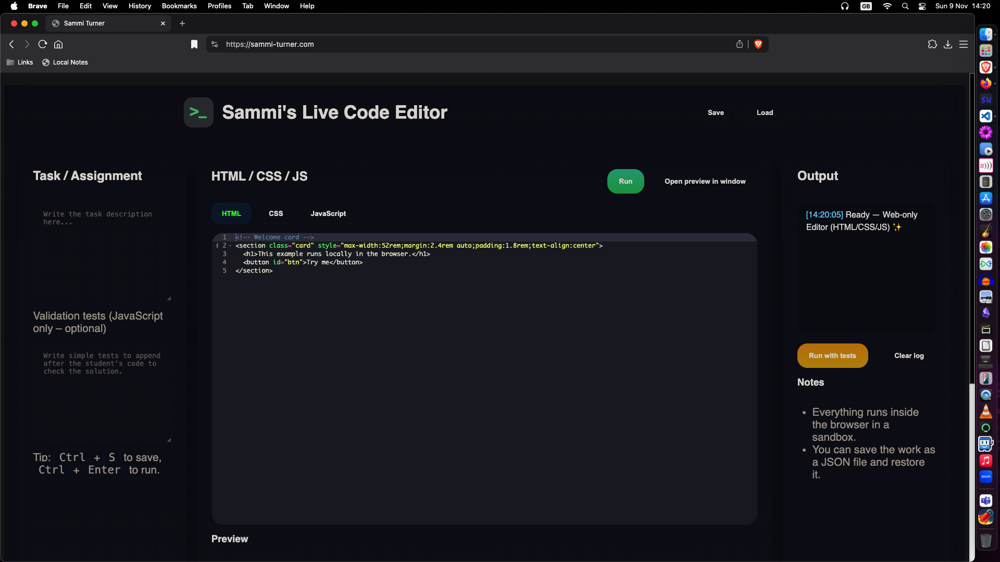

<br>

# Sammi's Live Code Editor

<br>

A lightweight, browser-based code editor for HTML, CSS, and JavaScript with live preview and instant testing capabilities. Perfect for teaching, learning, and rapid prototyping without any setup required.

<br>



<br>

## 🌟 Features

<br>

- **Triple Editor Setup**: Dedicated editors for HTML, CSS, and JavaScript
- **Live Preview**: See your code changes instantly in a sandboxed iframe
- **Test Integration**: Add validation tests that run alongside student code
- **Save & Load**: Export/import projects as JSON files
- **Local Storage**: Automatic backup of your work
- **Keyboard Shortcuts**: 
  - `Ctrl/Cmd + S` - Save project
  - `Ctrl/Cmd + Enter` - Run code
- **Responsive Design**: Works on desktop and tablet devices
- **Dark Theme**: Easy on the eyes with a modern dark interface
- **Sandboxed Execution**: Safe code execution in an isolated environment

<br>

## 🚀 Quick Start

<br>

1. **Clone the repository**
   ```bash
   git clone https://github.com/sammi-turner/Live-Code-Editor
   ```

2. **Open in Browser**
   Simply open `index.html` in your web browser. No server setup required!

3. **Start Coding**
   - Write HTML in the HTML tab
   - Add styles in the CSS tab  
   - Add functionality in the JavaScript tab
   - Click "Run" or press `Ctrl+Enter` to see live preview

<br>

## 📋 Usage Guide

<br>

### For Students

<br>

1. Open the editor in your browser
2. Write your code in the respective tabs
3. Click "Run" to see instant results
4. Your work is automatically saved locally

<br>

### For Teachers/Instructors

<br>

1. Write assignment instructions in the "Task" textarea
2. Add validation tests in the "Validation tests" area (JavaScript only)
3. Students can run tests with the "Run with tests" button
4. Share project files as JSON for standardized assignments

<br>

### Project Management

<br>

- **Save**: Downloads current project as `academy-web.json`
- **Load**: Upload previously saved JSON files
- **Preview**: Opens preview in a new window for full-screen testing

<br>

## 🛠️ Technical Details

<br>

### Built With

<br>

- **Vanilla JavaScript**: No frameworks, maximum compatibility
- **CSS Grid & Flexbox**: Modern, responsive layout
- **Local Storage API**: Client-side persistence
- **Blob API**: File download functionality

<br>

### File Structure

<br>

```
live-code-editor/
├── index.html          # Main application
├── script.js           # Core functionality
├── style.css           # Styling and themes
└── README.md           # Documentation
```

<br>

## 🎯 Use Cases

<br>

- **Coding Bootcamps**: Perfect for web development exercises
- **Online Courses**: Embed in LMS systems for interactive assignments
- **Interview Practice**: Quick prototyping without environment setup
- **Teaching Kids**: Simple interface for introducing web development
- **Rapid Prototyping**: Test ideas quickly without build tools

<br>

## 🔧 Customization

<br>

### Default Content

<br>

Modify the `setDefaultContent()` function in `script.js` to change the starter code:

```javascript
function setDefaultContent(){
  ed_html.setValue(`<!-- Your custom HTML -->`, -1);
  ed_css.setValue(`/* Your custom CSS */`, -1);
  ed_js.setValue(`// Your custom JavaScript`, -1);
}
```

<br>

### Theme Customization

<br>

Edit CSS custom properties in `style.css`:

```css
:root{
  --bg: #0f1221;           /* Background color */
  --brand: #7dd3fc;        /* Primary accent */
  --ok: #22c55e;           /* Success color */
  --warn: #eab308;         /* Warning color */
  --err: #ef4444;          /* Error color */
}
```

<br>

## 🧪 Testing

<br>

The editor includes a built-in testing system:

1. Write validation JavaScript in the "Validation tests" textarea
2. Tests run after student code in the same scope
3. Use `console.log()` for test feedback
4. Students click "Run with tests" to execute

Example test:

```javascript
// Check if button exists
const button = document.getElementById('myButton');
if (!button) {
  console.error('Button with id "myButton" not found');
}

// Check if click handler works
let clicked = false;
button.addEventListener('click', () => clicked = true);
button.click();
if (!clicked) {
  console.error('Button click handler not working');
}
```

<br>
